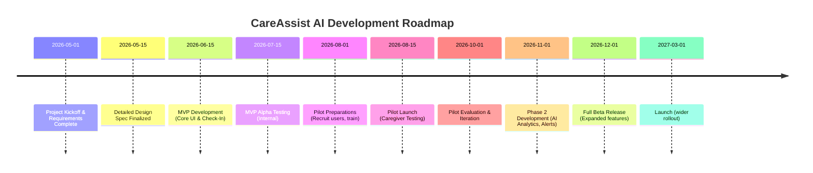

# Executive Summary  
CareAssist AI is an AI-driven elder-care ecosystem focused on Track 1: supporting family and professional caregivers. It enables older adults to report daily health, mood, and needs via a friendly voice/chat interface, and uses AI to detect risks (falls, delirium, missed medication, wandering) before they escalate. Caregivers see a unified dashboard with daily summaries, alerts, and simple guidance, dramatically reducing their workload and stress. The vision is a **proactive, human-centered platform** that predicts problems and automates routine tasks (scheduling, reminders, documentation) to improve care quality and caregiver well-being. This proposal outlines the product vision, target users, key problems (prioritized by ACL caregiver guidance and literature), measurable goals, MVP and advanced features, data/privacy design, technical stack, user flows, pilot evaluation plan, risks, and an implementation roadmap. **Tables** compare feature priorities, data sources, and metrics, and a **Mermaid timeline** shows the phased rollout. Finally, specific tasks are requested of Claude (e.g. refining the brief, generating user stories, API spec, evaluation plan, and slide summary).

## Vision and Project Title  
**Project Title:** *CareAssist AI – Intelligent Elder Care & Caregiver Support Ecosystem*  

**Vision:** CareAssist AI empowers caregivers with an AI “co-pilot” that learns from daily caregiver–elder interactions to **predict and prevent issues** before crises occur. Older adults use natural voice/chat to report how they feel (pain, appetite, mood, etc.), and the AI continuously analyzes patterns (sleep, mobility, medication adherence, nutrition, emotions). Caregivers get **real-time alerts and simple recommendations** (e.g. “fall risk increasing: suggest balance exercises”) and a consolidated care timeline. The system also automates routine tasks (appointment reminders, documentation) so caregivers can focus on empathy and decision-making. Over time, CareAssist AI adapts to each elder’s needs, aligning with ACL’s goal of “strengthening caregiving at home” through affordable AI solutions【42†L0-L4】【87†L5-L8】. The result is safer, more personalized home care, reduced caregiver burnout, and peace of mind for families.  

## Target Users & Personas  
- **Primary Caregivers:** Adult children or spouses providing daily care at home (ages 30–65). They juggle work, family, and elder care. They use smartphones/tablets and need concise, actionable information.  
- **Care Professionals:** Home health aides, nurses, social workers. They need efficient tools for documentation, compliance, and coordination.  
- **Secondary Users:** Healthcare providers (doctors, therapists) reviewing care reports; and the seniors themselves, who benefit from a respectful, easy interface.  

*Example personas:* “Maria” (45, working daughter caregiver, tech-savvy but time-starved), “John” (28, new caregiver for dementia parent, anxious about safety), “Nurse Kim” (36, home nurse, needs automated EVV and care logs).

## Problem Statements (Prioritized)  
Based on ACL guidance (NFCSP and caregiver reports) and literature, key caregiver pain points are:  

- **Overwhelm & Burnout:** Caregivers report constant **“reaction mode”** with no time to plan【7†L0-L2】【87†L5-L8】. They juggle 10–20 daily tasks (meds, meals, hygiene, appointments) with minimal support. Burnout is common, with ~20% at risk of emotional exhaustion.  
- **Task Coordination:** Managing schedules, medications, and appointments is complex. Caregivers lack tools to sync calendars, track multiple prescriptions, or coordinate family members. Missed meds and appointments are frequent.  
- **Health & Safety Monitoring:** Subtle declines (e.g. gait changes, mood swings, poor appetite) often go unnoticed until a crisis (fall, hospitalization). Early warning signs are missed due to time constraints.  
- **Dementia Behaviors:** Caregivers struggle with agitation, wandering, sundowning in dementia patients. They lack actionable insights on triggers or calming strategies.  
- **Communication Gaps:** Families and care teams lack a shared platform. Important observations (e.g. “Dad hasn’t eaten lunch for two days”) are siloed in caregivers’ notes.  
- **Emotional Isolation:** Caregivers feel stressed and lonely. They have little time for their own health, and need reminders to rest or seek help (respite care).  
- **Administrative Burden:** Paperwork, EVV compliance, and billing tasks consume caregiver time. They need easier documentation and verification.  

These problems align with ACL’s focus on caregiver support: training, respite, and coordination are often lacking, harming caregiver well-being【87†L5-L8】.  

## Goals & Metrics  
**Measurable objectives** include:  

- **User Engagement:** ≥50% of recruited caregivers using the app weekly; average 4 check-ins per week.  
- **Health Impact:** Reduce adverse events (falls, hospital visits) among pilot families by ≥20%.  
- **Caregiver Stress:** Improve self-reported caregiver stress scores by ≥15% in pilot (via survey).  
- **Efficiency:** Decrease time spent on care coordination tasks by ≥30% (self-reported or tracked).  
- **Retention:** Maintain ≥70% caregiver retention after 3 months.  
- **Feature Usage:** Track usage of key features (alerts acknowledged, tasks logged).  

| **Metric Category**    | **Metric**                           | **Baseline/Target**           |
|------------------------|--------------------------------------|-------------------------------|
| Engagement             | Weekly active caregivers (%)         | e.g. Target ≥50%              |
| Care Outcomes          | Falls/hospitalizations per elder/month |  Baseline vs –20% in pilot  |
| Caregiver Well-being   | Stress/burnout survey score         | Improve by ≥15%               |
| Efficiency            | Time on admin tasks (hours/week)     | Reduce by ≥30%                |
| Satisfaction          | System Usability Scale (SUS)        | Score ≥70                     |
| Compliance            | EVV / documentation completeness    | ≥90% accurate/complete        |  

## Required Features  

### MVP (Phase 1) Features (High Priority)  
1. **Voice/Chat Check-In:** Simple interface (voice and text) for elders to report daily status (mood, pain, appetite, sleep, meds taken). Natural language prompts (e.g. “How are you feeling today?”).  
2. **Care Dashboard:** Central app dashboard for caregivers showing the elder’s daily summary (from check-in), medication schedule, upcoming appointments, and any alerts.  
3. **Smart Alerts & Recommendations:** AI analyzes input and flags risks: missed medication, mood decline, fall risk (e.g. from instability in gait), dehydration risk (from low intake). Sends push notifications (e.g. “John missed breakfast for 2 days – check in”). Includes basic recommendations (e.g. “Try offering high-protein snack”).  
4. **Medication & Nutrition Tracker:** Easy logging of medicines taken (photo/scan Rx or voice log) and meals. Alerts if dosage skipped.  
5. **Care Plan & Reminders:** Shared care plan for tasks (e.g. physical therapy exercises). Automated reminders for meds, hydration, appointments (sync with calendars).  
6. **Secure Caregiver Communication:** In-app messaging or notes section so family members / nurses can share updates.  
7. **Privacy & Access Controls:** User consent flows and secure login (two-factor) to protect PHI.  

### Advanced (Phase 2+) Features (Medium Priority)  
- **Dementia Support:** Interactive games or prompts for cognitive stimulation; AI guidance on managing agitation (based on behavior history).  
- **Falls Detection & Prevention:** Integrate with wearable or mobile sensors (accelerometer) to detect falls or gait changes; proactive safety checks.  
- **Emotional Support Companion:** AI voice coach for caregiver well-being (e.g. mini mindfulness breaks, stress tips) and suggest when to take respite breaks.  
- **Automatic Documentation:** Voice-to-text for visit notes, and auto-generated summary reports (suitable for HCP review).  
- **Language Translation:** Real-time translation for non-English speaking caregivers.  
- **Telehealth Integration:** Ability to share data with doctors, or video-call integration.  

| **Feature**                       | **Priority** | **Type** | **Stage**      |
|-----------------------------------|-------------:|----------|----------------|
| Voice/Chat Check-In               | High         | Caregiver/Elder Interface  | MVP (Built)   |
| Care Dashboard (Daily Summary)    | High         | Caregiver Interface | MVP (Built)   |
| Smart Alerts & Predictions        | High         | AI Engine  | Phase 1       |
| Medication Tracker                | High         | Caregiver Tool | MVP           |
| Appointment & Med Reminders       | High         | Caregiver Tool | MVP           |
| Secure Messaging & Notes          | High         | Communication | MVP           |
| Data Privacy Controls (HIPAA)     | High         | Compliance | MVP           |
| Dementia Behavior Insights        | Medium       | AI Module | Phase 2+      |
| Falls Risk Monitoring (Wearable)  | Medium       | Sensor Integration | Phase 2  |
| Caregiver Emotional Support       | Medium       | AI Coach  | Phase 2       |
| Automated Visit Reports/EVV Docs  | Medium       | Backend Feature | Phase 2    |
| Multilingual Support              | Low/Optional | Localization | Phase 2+    |
| Telehealth Integration            | Low/Optional | Integration | Phase 2+     |

*Note:* The existing Lovable prototype includes basic **voice check-in** and **care dashboard** components, along with manual logging of meds and tasks. Key gaps (for Phase 1 completion) are implementing the AI alert engine and automated reminders, plus strengthening security/compliance (HIPAA) and seamless caregiver communication.

## Data Sources & Privacy/Compliance  
**Data Sources:**  
- **Self-Reported Inputs:** Elders’ voice/text responses (mood, symptoms, pain levels, food intake).  
- **Device Sensors:** Optional smartphone/wearable data (step count, falls via accelerometer, sleep patterns).  
- **Calendar & EHR:** Connected calendars (for appointments) and standard health records (optional, via APIs like HL7 FHIR).  
- **Caregiver Logs:** Notes and observations entered by caregivers.

| **Data Source**        | **Type**           | **Privacy Considerations**                                | **Use Case**                       |
|------------------------|--------------------|----------------------------------------------------------|------------------------------------|
| Voice/Text Check-ins   | Personal Health Data (PHI) | Must encrypt in transit/storage; obtain elder consent【47†L1-L4】 | Analyze mood, pain, cognition     |
| Medication Logs        | PHI (Rx info)      | HIPAA-covered; ensure secure storage and patient auth【47†L1-L4】 | Alert on missed/duplicate doses   |
| Wearable Sensors       | Health/Biometric   | Option to opt-in; anonymize where possible               | Detect falls, activity patterns    |
| Appointment Calendars  | Schedule Data      | Protected (could infer health); use OAuth2 secure links    | Generate reminders                |
| Caregiver Notes        | Observational Data | PHI if includes health info; require access controls       | Contextual triggers (behavior change) |

**Privacy & Compliance:** We will follow HIPAA Security and Privacy Rules strictly. All health-related inputs (e.g. check-in responses, med records) are treated as PHI: encrypted at rest and in transit, with user authentication and logging. Data access is role-based (only authorized caregivers can view an elder’s data). Compliance features include audit trails, data minimization, and user consent. We align with ACL guidance on privacy and dignity: elders control what’s shared. We also adhere to ADA accessibility standards for the UI and consider ACL’s emphasis on equity (e.g. easy language, large fonts).

## Technical Architecture  
- **Frontend:** React (web/mobile) with accessible UI; uses Tailwind CSS or Material UI for styling. On Lovable, these can be scaffolded.  
- **Backend/API:** FastAPI (Python) or Node.js/Express on a HIPAA-compliant cloud. RESTful APIs for data and AI calls.  
- **Database:** PostgreSQL (via Supabase for no-code auth and storage), encrypt sensitive fields.  
- **AI/ML Models:** Use cloud AI (OpenAI/GPT-4 or Anthropic Claude for NLP) for voice understanding and summarization; custom ML models for risk prediction (e.g. fall risk classifier).  
- **Voice Interface:** Integrate Twilio or Web Speech API for voice input; backend for speech-to-text processing.  
- **Integration:** Sync with Google/Apple Calendar APIs; optional FHIR integration for EHR (future).  
- **Hosting/Platform:** AWS/GCP with HIPAA-compliant services (e.g. Amazon HealthLake, Google Healthcare API) or Azure with HITRUST certification for  production.

**Technical Considerations:**  
- Use Lovable’s built-in Supabase auth and DB for rapid prototyping.  
- Ensure GDPR/HIPAA-level encryption (SSL, AES-256).  
- Modular microservices: e.g. one service for AI analysis, one for notifications.  
- Use feature flags for pilot vs general rollout features.

## UX Flow & Key Screens  
1. **Login/Onboarding:** Secure user login (multi-user: caregiver, elder). New caregivers set up elder profile, emergency contacts.  
2. **Daily Check-In (Voice/Chat):** Simple screen (or voice prompt) where elder answers a few questions (pain, mood, medication taken). Can be in voice or simple form.  
3. **Care Dashboard (Home):** Displays today’s summary: medication schedule, any missed meds, current mood, step count, upcoming events. Key alerts (e.g. red warning if fall risk high).  
4. **Alerts & Recommendations:** Pop-up or panel showing critical alerts (e.g. “Action Needed: [issue]”) with short tips and “Mark as resolved” actions.  
5. **Medication & Nutrition Log:** Screen to scan/enter meds and log meals/water intake. Simple checklist style UI.  
6. **Appointments & Reminders:** Calendar view of upcoming doctor visits or therapy, with reminder toggle.  
7. **Family Notes / Messaging:** Chat-like interface for family team to post updates, or call a telehealth link.  
8. **Reports:** View of historic trends (graph of mood or sleep). One-click report export (PDF) for doctors.  

**UX Flow:** Caregiver opens app → views alerts on Dashboard → clicks into any alert for details (or into Diet/Med tracking) → reviews trending chart or logs a new entry → checks off tasks. Elders primarily use the Check-In screen daily; caregivers use Dashboard and Reports. The UI prioritizes clarity: large text, minimal input effort, and voice prompts for low-literacy users.

## Demonstration Scenarios & Acceptance Criteria  
- **Scenario 1:** *Daily Check-In.* The elder uses voice to say “I have a headache today.” The AI correctly transcribes and flags mild pain, and the dashboard shows “Headache” under today’s symptoms. *Acceptance:* Voice input accurately captured; symptom logged.  
- **Scenario 2:** *Missed Medication Alert.* The caregiver logged two medications in the evening schedule. After 8 PM passes without a log, the AI sends “Alert: [MedName] missed.” *Acceptance:* Notification delivered; caregiver can mark as “Taken late” or “Skipped.”  
- **Scenario 3:** *Fall Risk Prediction.* The elder’s walking speed in daily logs has declined. The AI alerts “Increased fall risk – suggest balance exercises.” *Acceptance:* Dashboard flags fall risk and provides exercise tip.  
- **Scenario 4:** *Caregiver Wellness.* The caregiver’s stress score (self-reported weekly) is high. The app suggests a 5-minute breathing exercise and reminds them of a local respite-care line. *Acceptance:* Suggestion triggers appropriately; caregiver acknowledges advice.  
- **Scenario 5:** *Documentation.* Caregiver finishes a visit and speaks a short note (“Today, Mom refused breakfast and seemed very tired.”). The AI converts to text, tags relevant category (Nutrition), and adds to care log. *Acceptance:* Voice note transcribed correctly and saved in logs.

Each scenario’s success is measured by UX tests (accuracy of voice capture ≥90%, no critical UI errors, correct notifications). 

## Evaluation Plan  
**Pilot Design:** Deploy in a small-scale pilot with ~10–20 caregiver–elder pairs for 3–6 months. Collect usage data and pre/post surveys. Use mixed methods:  
- **Quantitative KPIs:** Reduction in tracked adverse events (falls, skipped meds), time-on-task metrics, feature usage stats.  
- **Qualitative Feedback:** Weekly check-ins with caregivers for feedback. Exit interviews to assess ease-of-use and perceived support.  

**Key Performance Indicators:** Caregiver stress (validated scale), elder health events, app engagement (active days/week), alert response time. Success is defined as meeting the goals above (see Metrics table). Pilot findings will inform iterative improvements.

**Evaluation Outcome:** A report summarizing pilot results (with charts) and recommendations for feature refinement. This will be an input into Phase 2 development.

## Risks & Mitigation  
- **Data Privacy Breach:** Health data is sensitive. *Mitigation:* Use end-to-end encryption, HIPAA-ready cloud services, regular security audits, and user training on device security.  
- **Low Adoption:** Elderly may resist tech. *Mitigation:* Design extremely simple UI (voice-first), provide caregiver training. Offer multilingual support and large fonts.  
- **Inaccurate AI Alerts:** False alarms could annoy users. *Mitigation:* Tune thresholds carefully; start with conservative alert settings. Allow easy suppression of irrelevant alerts and continuous learning from user feedback.  
- **Technical Complexity:** Integrating voice, AI, and scheduling is complex. *Mitigation:* Build modular MVP focusing on core functionality first; use proven APIs (Twilio, OpenAI). Conduct thorough testing on each component.  
- **Regulatory Compliance:** Risk of non-compliance with HIPAA/ACL guidelines. *Mitigation:* Consult legal on HIPAA; implement standard protocols (data encryption, audit logs). Follow ACL’s ethical guidelines for elder care (dignity and accessibility).  

## Timeline & Roadmap  

This phased timeline (MVP → Pilot → Scale) ensures early feedback and iterative improvement. The **MVP (May–July 2026)** focuses on core check-in and dashboard. The **Pilot (Aug–Oct 2026)** tests in real homes. Phase 2 (Nov 2026 onward) builds advanced AI features.

## Ask for Claude (Next Steps)  
To refine this plan, we request Claude to:  
- **Generate a polished Product Brief:** Incorporate this outline into a cohesive executive document (with refined wording and flow).  
- **Write Detailed User Stories:** For each persona, list features as user stories (As a [user], I want [feature] so that [benefit]).  
- **Draft API Specifications:** Sketch REST API endpoints/data models for key features (check-in, alerts, documentation).  
- **Create Prompt Templates:** Provide example prompts that the AI would use internally (e.g. for summarizing a voice note or detecting risk from trends).  
- **Outline an Evaluation Plan:** Expand on KPIs and pilot methodology (surveys, data collection, analysis).  
- **Prepare Slide Deck Summary:** A concise set of slides highlighting vision, problems, solution, features, and roadmap.

Including tables of **feature priorities**, **data sources**, and **metrics** in the brief will clarify planning. The mermaid timeline above should be rendered into a visual Gantt/timeline chart for presentations.

**Next Steps:** With Claude’s outputs, we will polish this proposal for submission. Meanwhile, the Lovable project can begin implementing the MVP screens (use Lovable templates for login, chatbot, dashboard) and integrate Supabase for data. The technical team should set up the cloud environment and initial AI API keys to accelerate development.

